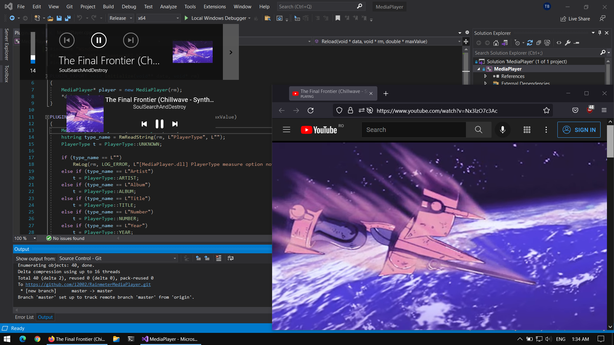

#Media Player Rainmeter plugin
This plugin implements `NowPlaying` measure functionality for all media players that show up in Windows 10 volume change notification (including web based ones, Spotify).\
Any skin that works with the `NowPlaying` measure can be modified to work with this plugin.




## Requirements
- newest stable Rainmeter release
- Windows 10 (version 1809 or newer)


## Installation
The `media_player.rmskin` file from [Releases](https://github.com/i2002/RainmeterMediaPlayer/releases) section installs the plugin along with a sample skin for showing media player status (shown in the screenshot above).\
Alternativelly, you can download the `.dll` for your platform.


## Usage
### Sample skin
The skin displays information for the active media player. If there are multiple media players active, you can change the current one using the arrow in Windows change volume popup

### Measure
The plugin has the same options as the `NowPlaying` measure ([Rainmeter documentation](https://docs.rainmeter.net/manual/measures/nowplaying/))

```
[mTitle]
Measure=Plugin
PluginName=MediaPlayer.dll
PlayerType=Title
```

### Modify other skins that use NowPlaying
- find the `.ini` file where the `NowPlaying` measures are defined
- replace `Measure=NowPlaying` or `Measure=Plugin\nPlugin=NowPlaying` with `Measure=Plugin\nPlugin=MediaPlayer.dll`
- save the file and reload the skin


## Limitations
- not all players support all the features (for example Youtube playback doesn't provide playback position)
